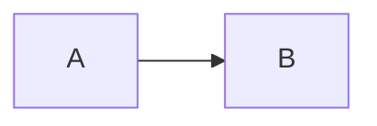

# 4. Application Architecture Visualization

Date: 2024-03-24

## Status

2024-03-24 accepted

## Context

The application architecture can be represented in several places. One of them is Confluence or any other similar tool. It can also be presented in the form of documentation in a repository.

The easiest and most commonly used approach is the `mermaidjs` library, which offers several ways to create such documentation.
- Live editor where an easy builder allows creating diagrams using a graphical interface
- Mermaid plugin for IDE
- JS API
- As a dependency in code

## Decision

In our case, the best approach is to use IDE plugins with MARKDOWN. Each team member might use a different IDE, which is not a problem. Also, the MARKDOWN language is not specific to any particular backend language and can be displayed everywhere including Github, Gitlab, or any other place.
Mermaid also supports specific C4 syntax.



#### Extension

`Markdown Preview Mermaid Support`

## Consequences
There might be a number of files in the project that will grow over time. However, this is a natural consequence of a growing documentation base. It's important to keep these files in a readable and organized structure to facilitate navigation and maintenance.

## Alternatives
Other diagram creation tools such as Graphviz and Draw.io were also considered. Ultimately, Mermaid.js was chosen due to its ease of use, support for MARKDOWN, and the ability to integrate with various IDEs.

## Impact on Code
The use of Mermaid.js will not directly affect the application code, but it may influence how the team understands and documents the application architecture. Good diagrams can help in better understanding the data flow and structure of the application.

There might be specific scenarios, where we would like to link particular implementation in code adding a comment to the code like so:

```typescript
// [MermaidChart: a1c51f22-dbf1-4340-8909-36ee89bf5213]
function addToNumbers(num1: number, num2: number)
```

## Impact on the Team
The team will need to learn how to use Mermaid.js and MARKDOWN to create and update diagrams. This may require some training or self-learning, but ultimately it should bring benefits in the form of better documentation and understanding of the application architecture.
